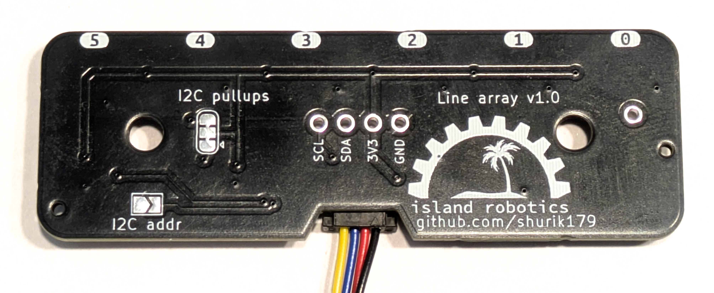
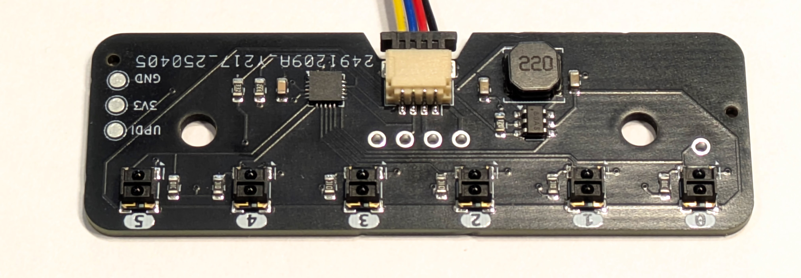
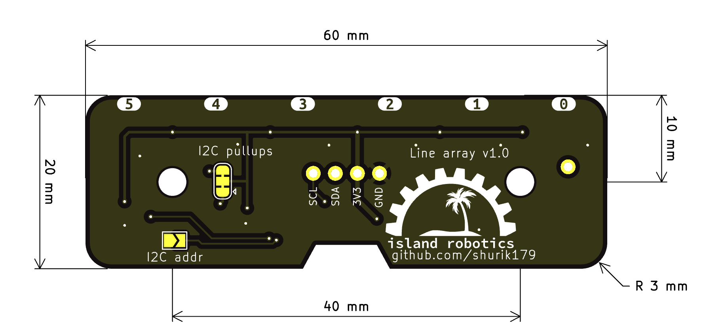

**********************
Hardware details
**********************

    

The photos above show the reflectance array sensor board. It contains the following elements:

* Six individual reflectance sensors. We use `ITR1502 <https://www.everlight.com.cn/wp-content/plugins/ItemRelationship/product_files/pdf/ITR1502SR40A-TR8.pdf>`__ 
  sensors, which have much longer range than typical reflectance sensor (4mm vs 1mm). The sensors are spaced 10mm apart
* Constant current LED driver; this makes the sensor much more efficient as no power is wasted on resistors
* An attiny 1616 MCU 
* A `qwiic/stemma qt <https://www.sparkfun.com/qwiic>`__ connector and holes for soldering an 0.1" headers

Board dimensions are shown below. 

    

To connect the sensor to your microcontroller, use a qwiic cable to connect it to the i2c connector of the MCU. 

By default, the sensor uses i2c address 0x11. However, you can change that: if you close the solder bridge 
labeled "I2C addr", the sensor will use i2c address  0x12. This allows one to use two such sensors on the same i2c bus.

The sensor contains 3.3k pullup resistors on SCL, SDA lines. If for some reason you do not need them (e.g., 
the host MCU already provides pullups), you can disable them by cutting the two traces of the "I2C pullups" 
solder bridge using a sharp knife. 

To mount the sensor to your robot, you can use the mounting holes; they  have 3.2mm diameter 
and are intended to be used with M3 screws. Alternatively, you can make a 3d-printed snap mount - one such snap 
mount for XPR robot can be found in 3d printed folder in |github|.  The sensor should be mounted so that the 
distance from the bottom of the PCB to ground is about 6 mm.  
